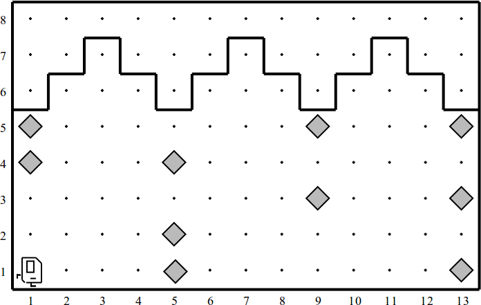

# Karel the Robot

"Karel is a very simple robot living in a very simple world. By giving Karel a
set of commands, you can direct it to perform certain tasks within its world.
The process of specifying those commands is called programming. Initially,
Karel understands only a very small number of predefined commands, but an
important part of the programming process is teaching Karel new commands that
extend its capabilities".[^1]

## Getting started

* Go into the `prog` directory you made in the Getting Started by executing

       cd prog

* Create another directory for this problem set (`mkdir pset1`) and `cd` into
  that as well.

* You can get the starter kit [here](cdn://pset1.zip) you can download it with
  `wget <url>`.

* Unpack it in the current directory with `unzip pset1.zip`.

* Compile all your source files by issuing the `make` command. If everything
  went well, you get no errors.

* Try running the first problem using

       java -cp .:karel.jar CollectNewspaperKarel

  This runs the CollectNewspaperKarel class. But alas, nothing happens if your
  press **run** of course, because you still have to implement the code!

* Now, when in the `pset1` directory, run the following command to start your
  editor and get programming!

## About the use of Java

You cannot use any other constructs in your programs than those mentioned on
the last page of the Karel book (cheat sheet!). All of these exercises are
designed to be solvable without the use of variables.

For both these problems, your program should work for **every relevant world** 
that came with the starter kit!

Also, you should not use recursion, in order to practice with iterative 
solutions. You have done enough recursion in the Logic Programming course!

## Problem 1: `StoneMasonKarel.java`

Karel has been hired to repair the damage done to the Quad in the 1989
earthquake. In particular, Karel is to repair a set of arches where some of the
stones (represented by beepers, of course) are missing from the columns
supporting the arches, as follows:

Your program should work on the world shown above, but it should be general
enough to handle any world that meets certain basic conditions as outlined at
the end of this problem. There are several example worlds in the starter folder,
and your program should work correctly with all of them.

When Karel is done, the missing stones in the columns should be replaced by
beepers, so that the final picture resulting from the world shown above would
look like this:

Karel may count on the following facts about the world:

* Karel starts at 1st Avenue and 1st Street, facing east, with an infinite
  number of beepers.
* The columns are exactly four units apart, on 1st, 5th, 9th Avenue, and so
  forth.
* The end of the columns is marked by a wall immediately after the final
  column. This wall section appears after 13th Avenue in the example, but your
  program should work for any number of columns.
* The top of the column is marked by a wall, but Karel cannot assume that
  columns are always five units high, or even that all columns are the same
  height.
* Some of the corners in the column may already contain beepers representing
  stones that are still in place. Your program should not put a second beeper on
  these corners.

Implement your solution in `StoneMasonKarel.java`.

## Problem 2: `CheckerboardKarel.java`

In this exercise, your job is to get Karel to create a checkerboard pattern of
beepers inside an empty rectangular world, as illustrated in the following
before-and-after diagram:

This problem has a nice decomposition structure along with some interesting
algorithmic issues. As you think about how you will solve the problem, you
should make sure that your solution works with checkerboards that are different
in size from the standard 8 x 8 checkerboard shown in the example. Odd-sized
checkerboards are tricky, and you should make sure that your program generates
the following pattern in a 5 x 3 world:

Another special case you need to consider is that of a world which is only one
column wide or one row high. The starter folder contains several sample worlds
that test these special cases, and you should make sure that your program works
for each of them.

Implement your solution in `CheckerboardKarel.java`.

[^1]: From [Karel the robot learns Java](http://www.stanford.edu/class/cs106a/handouts/karel-the-robot-learns-java.pdf)
