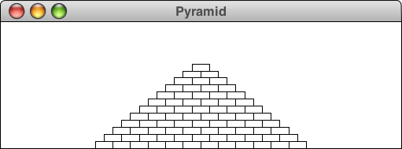
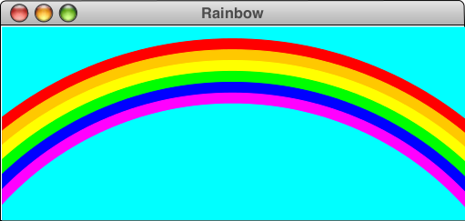

# Graphics Programs

Now, let's write two programs using the ACM graphics library. This is a
*library* of commands and classes that you can use in your own programs to draw
graphics with relative ease. Here's some documentation that may help you out:

* [All documentation](http://cs.stanford.edu/people/eroberts/jtf/javadoc/student/acm/graphics/)
* [GraphicsProgram](http://cs.stanford.edu/people/eroberts/jtf/javadoc/student/acm/program/GraphicsProgram.html)
* [GRect](http://cs.stanford.edu/people/eroberts/jtf/javadoc/student/acm/graphics/GRect.html)

## Problem 3: `Pyramid.java`

Write a `GraphicsProgram` subclass that draws a pyramid consisting of bricks
arranged in horizontal rows, so that the number of bricks in each row decreases
by one as you move up the pyramid, as shown in the following sample run:

The pyramid should be centered at the bottom of the window and should use
constants for the following parameters:

| variable         | description                           |
|------------------|---------------------------------------|
| `BRICK_WIDTH`    | The width of each brick (30 pixels)   |
| `BRICK_HEIGHT`   | The height of each brick (12 pixels)  |
| `BRICKS_IN_BASE` | The number of bricks in the base (12) |

A constant is declared by preceding the variable with the keywords `final` and
`static`. Constants are usually declared at class level, right below the opening
brace. See the example below.

~~~ java
public class Pyramid extends GraphicsProgram
{
    static final int BRICK_WIDTH = 30;
}
~~~

Our goal is that your program will produce the correct output even if we change
these constants to other (reasonable) values. We might check your program with
a brick width of 2 pixels and see if it still works! However, a brick width of
0 pixels makes no sense in this case, so we will not check that option.

## Problem 4: `Rainbow.java`

Write a `GraphicsProgram` subclass that draws a rainbow that looks like this:

The colors of the stripes are clear in the web version of the picture, but are
hard to see in the black-and-white handout. Starting at the top, the six arcs
are red, orange, yellow, green, blue, and magenta, respectively; cyan makes a
lovely color for the sky. At first glance, it might seem as if you need to draw
arcs on the screen, even though you won't actually learn about the `GArc` class
until Lecture 10. As it turns out, that class doesn't really help much. The
program that produced the diagram shown uses only circles, although seeing how
this is possible forces you to think outside the box---in a literal rather than a
figurative sense. The common center for each circle is some distance below the
bottom of the window, and the diameters of the circles are wider than the
screen. The `GraphicsProgram` shows only the part of the figure that actually
appears in the window. This process of reducing a picture to the visible area
is called clipping.

> Now, how do you draw circles? Best to browse around in the ACM Library 
documentation. This documentation was generated by a tool called `javadoc`
which generates documentation from all comments in a set of Java classes. So,
if looking for anything in the ACM Library, you're bound to find something
there!

Rather than specify the exact dimensions of each circle, play around with the
sizes and positioning of the circles until you get something that matches your
aesthetic sensibilities. The only things we'll be concerned about are:

* The top of the arc should not be off the screen.
* Each of the arcs in the rainbow should get clipped along the sides of the top,
  and not along the bottom.
