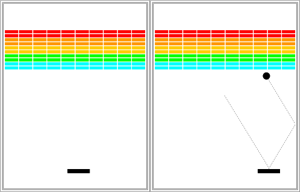
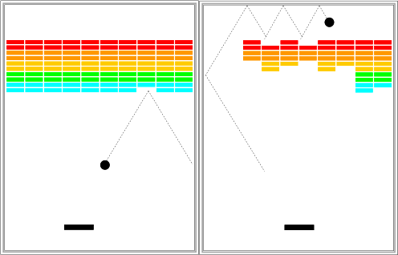
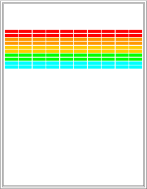

# Backstory

*One day in the late summer of 1975, Nolan Bushnell [founder of Atari and, um, Chuck E. Cheese’s], defying the prevailing wisdom that paddle games were over, decided to develop a single-player version of Pong; instead of competing against an opponent, the player would volley the ball into a wall that lost a brick whenever it was hit. He called [Steve] Jobs into his office, sketched it out on his little blackboard, and asked him to design it. There would be a bonus, Bushnell told him, for every chip fewer than fifty that he used. Bushnell knew that Jobs was not a great engineer, but he assumed, correctly, that he would recruit [Steve] Wozniak, who was always hanging around. "I looked at it as a two-for-one thing," Bushnell recalled. "Woz was a better engineer."*

*Wozniak was thrilled when Jobs asked him to help and proposed splitting the fee. "This was the most wonderful offer in my life, to actually design a game that people would use," he recalled. Jobs said it had to be done in four days and with the fewest chips possible. What he hid from Wozniak was that the deadline was one that Jobs had imposed, because he needed to get to the All One Farm to help prepare for the apple harvest. He also didn’t mention that there was a bonus tied to keeping down the number of chips.*

*"A game like this might take most engineers a few months," Wozniak recalled. "I thought that there was no way I could do it, but Steve made me sure that I could." So he stayed up four nights in a row and did it. During the day at HP, Wozniak would sketch out his design on paper. Then, after a fast-food meal, he would go right to Atari and stay all night. As Wozniak churned out the design, Jobs sat on a bench to his left implementing it by wire-wrapping the chips onto a breadboard. "While Steve was breadboarding, I spent time playing my favorite game ever, which was the auto racing game Gran Trak 10," Wozniak said.*

*Astonishingly, they were able to get the job done in four days, and Wozniak used only forty-five chips. Recollections differ, but by most accounts Jobs simply gave Wozniak half of the base fee and not the bonus Bushnell paid for saving five chips. It would be another ten years before Wozniak discovered (by being shown the tale in a book on the history of Atari titled Zap) that Jobs had been paid this bonus....*

*Steve Jobs*  
--- Walter Isaacson

## Getting started

Download the starter kit from [here](cdn://pset2.zip) and extract it in your
**Dropbox** directory:

    cd Dropbox
    wget --content-disposition "http://.../pset2.zip"
    unzip pset2.zip

Now **cd** into **pset2** and you're ready to start!

## The Breakout game

In Breakout, the initial configuration of the world appears as shown on the
right. The colored rectangles in the top part of the screen are bricks, and the
slightly larger rectangle at the bottom is the paddle. The paddle is in a fixed
position in the vertical dimension, but moves back and forth across the screen
along with the mouse until it reaches the edge of its space.

A complete game consists of three turns. On each turn, a ball is launched from
the center of the window toward the bottom of the screen at a random angle. That
ball bounces off the paddle and the walls of the world, in accordance with the
physical principle generally expressed as "the angle of incidence equals the
angle of reflection" (which turns out to be very easy to implement as discussed
later in this handout). Thus, after two bounces—one off the paddle and one off
the right wall—the ball might have the trajectory shown in the second
diagram. (Note that the dotted line is there only to show the ball's path and
won't appear on the screen.)

As you can see from the second diagram, the ball is about to collide with one of
the bricks on the bottom row. When that happens, the ball bounces just as it
does on any other collision, but the brick disappears. The third diagram shows
what the game looks like after that collision and after the player has moved the
paddle to put it in line with the oncoming ball.

The play on a turn continues in this way until one of two conditions occurs:

* The ball hits the lower wall, which means that the player must have missed it
  with the paddle. In this case, the turn ends and the next ball is served if
  the player has any turns left. If not, the game ends in a loss for the player.
* The last brick is eliminated. In this case the player wins, and the game ends immediately.

After all the bricks in a particular column have been cleared, a path will open
to the top wall. When this delightful situation occurs, the ball will often
bounce back and forth several times between the top wall and the upper line of
bricks without the user ever having to worry about hitting the ball with the
paddle. This condition is a reward for "breaking out" and gives meaning to the
name of the game. The diagram on the right shows the situation shortly after the
first ball has broken through the wall. That ball will go on to clear several
more bricks before it comes back down the open channel.

It is important to note that, even though breaking out is a very exciting part
of the player's experience, you don't have to do anything special in your
program to make it happen. The game is simply operating by the same rules it
always applies: bouncing off walls, clearing bricks, and otherwise obeying the
laws of physics.

## The starter file

The starter project for this assignment has a little more in it than it has in
the past, including some of the structure of the program. This file takes care
of the following details:

* It includes the imports you will need in writing the game.
* It defines the named constants that control the game parameters, such as the
  dimensions of the various objects. Your code should use these constants
  internally so that changing them in your file changes the behavior of your
  program accordingly.
* It defines some of the instances variables that should be part of your game,
  such as the ball and the paddle. Your code should use these variables, so you 
  can  still access these variables from other functions after you've added 
  them to the canvas.
* It contains a list of functions that you can you use to decompose the game.
  Filling in these functions and then calling them in the correct place will 
  make your life a lot easier. Feel free to add more functions to the code of 
  course, but it strongly suggested that you at least use the ones provided.
* If defines a function `getCollidingObject()`, which already solves a part of 
  the problem of collisions for you. *Make sure to use it!*

Success in this assignment will depend on beraking up the problem into
manageable pieces and getting each one working before you move on to the
next. The next few sections describe a reasonable staged approach to the
problem.

## Set up the bricks

Before you start playing the game, you have to set up the various pieces. Thus,
it probably makes sense to implement the run method as two method calls: one
that sets up the game and one that plays it. An important part of the setup
consists of creating the rows of bricks at the top of the game, which look like
this:

The number, dimensions, and spacing of the bricks are specified using named
constants in the starter file, as is the distance from the top of the window to
the first line of bricks. The only value you need to compute is the x coordinate
of the first column, which should be chosen so that the bricks are centered in
the window, with the leftover space divided equally on the left and right
sides. The color of the bricks remain constant for two rows and run in the
following rainbow-like sequence: `RED`, `ORANGE`, `YELLOW`, `GREEN`, `CYAN`.

This part of the assignment is almost exactly like the pyramid problem from the
previous problem set. The parts that are only a touch more difficult are that
you need to fill and color the bricks. This extra complexity is more than
compensated by the fact that there are the same number of bricks in each row,
and you don't have to change the coordinate calculation from row to row.

For this part of the problem, fill in the functions `createBricks()` and 
`createBrickRow()`. Call these functions in the `run()` to actually add them to 
your game. Use the constants at the top of the file to determine how 
many bricks to add. Don't worry too much about getting the bricks centered 
pixel perfectly, it might be slightly off due to rounding of the values.

## Create the paddle

The next step is to create the paddle. At one level, this is considerably easier
than the bricks. There is only one paddle, which is a filled `GRect`. You even
know its position relative to the bottom of the window.

The challenge in creating the paddle is to make it track the mouse. You have to
pay attention to the x coordinate of the mouse because the y position of the
paddle is fixed. The only wrinkle is that you should not let the paddle move off
the edge of the window. Thus, you'll have to check to see whether the x
coordinate of the mouse would make the paddle extend beyond the boundary and
change it if necessary to ensure that the entire paddle is visible in the
window.

Detecting keyboard or mouse input is done using **event listeners**. In 
`GraphicsProgram` there is a function called `addMouseListeners()`, 
which adds the current program as a `MouseMotionListener`. What that means is 
that every time the mouse is moved, Java will try to call the `mouseMoved()`
function in your program, passing it a `MouseEvent`. You can then use that 
`MouseEvent` in your function to ask details about the current state of mouse, 
like which buttons were clicked and where the mouse is on the screen. Below are 
links to the relevant parts of the documentation:

* [addMouseListeners](https://cs.stanford.edu/people/eroberts/jtf/javadoc/student/acm/program/GraphicsProgram.html#addMouseListeners%28%29)
* [MouseMotionListener](https://docs.oracle.com/javase/6/docs/api/java/awt/event/MouseMotionListener.html)
* [MouseEvent](https://docs.oracle.com/javase/6/docs/api/java/awt/event/MouseEvent.html)

Implement the `createPaddle()` function, which should use the instance variable 
*GRect paddle* and add it to the screen. Also fill in the `mouseMoved()`
function, which should update your program each time the mouse moves!

## Create a ball and get it to bounce off the walls

At one level, creating the ball is easy, given that it's just a filled
`GOval`. The interesting part lies in getting it to move and bounce
appropriately. You are now past the "setup" phase and into the "play" phase of
the game. To start, create a ball and put it in the center of the window. As you
do so, keep in mind that the coordinates of the `GOval` do not specify the
location of the center of the ball but rather its upper left corner. The math is
not any more difficult, but may be bit less intuitive.

The program needs to keep track of the velocity of the ball, which consists of
two separate components, which you will presumably declare as instance variables
like this:

    private double vx;
    private double vy;

The velocity components represent the change in position that occurs on each
time step. Initially, the ball should be heading downward, and you might try a
starting velocity of +3.0 for `vy` (remember that y values in Java increase as
you move down the screen). The game would be boring if every ball took the same
course, so you should choose the `vx` component randomly. We'll talk about
random numbers later in the quarter, but for now you should simply do the
following:

1) Declare an instance variable `rgen`, which will serve as a random-number generator:

    private RandomGenerator rgen = RandomGenerator.getInstance();

2) Remember that instance variables are declared outside of any method but inside the class.

Initialize the `vx` variable as follows:

    vx = rgen.nextDouble(1.0, 3.0);
    if (rgen.nextBoolean(0.5))
        vx = -vx;

This code sets `vx` to be a random `double` in the range 1.0 to 3.0 and then
makes it negative half the time. This strategy works much better for Breakout
than calling `nextDouble(-3.0, +3.0)`, which might generate a ball going more or
less, straight down. That would make life far too easy for the player.

3) Wait for the user to click the mouse before starting the ball. This operation
is much simpler than you might at first think because the `GraphicsProgram`
class includes a `waitForClick()` method that does exactly what you want.

Once you've gotten things started, your next challenge is to get the ball to
bounce around the world, ignoring the paddle and the bricks entirely. To do so,
you need to check to see if the coordinates of the ball have gone beyond the
boundary, taking into account that the ball has a nonzero size. Thus, to see if
the ball has bounced off the right wall, you need to see whether the coordinate
of the right edge of the ball has become greater than the width of the window;
the other three directions are treated similarly. For now, have the ball bounce
off the bottom wall so that you can watch it make its path around the world. You
can change that test later so that hitting the bottom wall signifies the end of
a turn.

Computing what happens after a bounce is extremely simple. If a ball bounces off
the top or bottom wall, all you need to do is reverse the sign of
`vy`. Symmetrically, bounces off the side walls simply reverse the sign of `vx`.

Fill in the function `createBall()` and `bounceWalls()`, which should check if 
the ball has hit a wall and change the direction accordingly. Complete the
setup part of the `run()` function, so you game starts correctly.

Now you can start filling in the main game loop. What should happen for each
*step* of the game?

## Checking for collisions

In order to make Breakout into a real game, you have to be able to tell whether 
the ball is colliding with another object in the window. In the starter file 
there is function provided called `getCollidingObject()`, which checks a number 
of points around the ball to see if there are objects there. If there is an 
object at one of these points, then then ball has collided and the object is
returned. The function returns `null` otherwise. You can use it like so

~~~ java
GObject collider = getCollidingObject();
~~~

which assigns that value to a variable called `collider`.

So the only remaining thing you need to do is decide what to do when a
collision occurs. There are only two possibilities. First, the object you get
back might be the paddle, which you can test by checking

~~~ java
if (collider == paddle) . . . 
~~~

If it is the paddle, you need to bounce the ball so that it starts traveling
up. If it isn't the paddle, the only other thing it might be is a brick, since
those are the only other objects in the world. Once again, you need to cause a
bounce in the vertical direction, but you also need to take the brick away. To
do so, all you need to do is remove it from the screen by calling the remove
method.

Think about where in the code you should make this collision check and add it 
to your code!

## Finishing up

If you've gotten to here, you've done all the hard parts. There are however, a
few more details you need to take into account:

* You've got to take care of the case when the ball hits the bottom wall. In the
  prototype you've been building, the ball just bounces off this wall like all
  the others, but that makes the game pretty hard to lose. You've got to modify
  your loop structure so that it tests for hitting the bottom wall as one of its
  terminating conditions.
* You've got to check for the other terminating condition, which is hitting the
  last brick. How do you know when you've done so? Although there are other ways
  to do it, one of the easiest is to have your program keep track of the number
  of bricks remaining. Every time you hit one, subtract one from that
  counter. When the count reaches zero, you must be done. In terms of the
  requirements of the assignment, you can simply stop at that point, but it
  would be nice to give the player a little feedback that at least indicates
  whether the game was won or lost.
* You've got to experiment with the settings that control the speed of your
  program. How long should you pause in the loop that updates the ball? Do you
  need to change the velocity values to get better play action?
* You've got to test your program to see that it works. Play for a while and
  make sure that as many parts of it as you can check are working. If you think
  everything is working, here is something to try: Just before the ball is going
  to pass the paddle level, move the paddle quickly so that the paddle collides
  with the ball rather than vice-versa. Does everything still work, or does your
  ball seem to get “glued” to the paddle? If you get this error, try to
  understand why it occurs and how you might fix it.

## Strategy and tactics

Here are some survival hints for this assignment:

* *Start as soon as possible.* This assignment is due on Friday, which will be
   here before you know it. If you wait until the until the last moment, you
   will have a very hard time getting it all together.
* *Implement the program in stages, as described on this page.* Don't try to get
   everything working all at once. Implement the various pieces of the project
   one at a time and make sure that each one is working before you move on to
   the next phase.
* *Don't try to extend the program until you get the basic functionality
   working.* The following section describes several ways in which you could
   extend the implementation. Several of those are lots of fun. Don't start
   them, however, until the basic assignment is working. If you add extensions
   too early, you'll find that the debugging process gets really difficult.

## Possible extensions

This assignment is perfect for those of you who are looking to learn a little
extra Java, because there are so many possible extensions. Here are a few:

* *Add messages.* A message can be implemented as a `GLabel` object that you add
   and remove at the appropriate time. You can announce that the game starts as
   soon as the player clicks with the mouse and when the player has won or lost
   at the end of the game.
* *Improve the user control over bounces.* The program gets rather boring if the
   only thing the player has to do is hit the ball. It is far more interesting,
   if the player can control the ball by hitting it at different parts of the
   paddle. The way the old arcade game worked was that the ball would bounce in
   both the x and y directions if you hit it on the edge of the paddle from
   which the ball was coming.
* *Add in the "kicker."* The arcade version of Breakout lured you in by starting
   off slowly. But, as soon as you thought you were getting the hang of things,
   the program sped up, making life just a bit more exciting. The applet version
   implements this feature by doubling the horizontal velocity of the ball the
   seventh time it hits the paddle, figuring that's the time the player is
   growing complacent.
* *Keep score.* You could easily keep score, generating points for each
   brick. In the arcade game, bricks were more valuable higher up in the array,
   so that you got more points for red bricks than cyan bricks. You could
   display the score underneath the paddle, since it won't get in the way there.
* *Use your imagination.* What else have you always wanted a game like this to do?

## Submit

* You can make a zip with the required files by running the following command
  in a terminal.

      make submit

  You can submit a problem set multiple times, we always grade at the last
  submission before the deadline. Make sure to submit all files when you
  resubmit, not only the files that changed.

* Go to form below and send your ZIP-file to us. After the weekend, you'll
  see if you got a grade or if your submission was rejected.

* In all cases, ask your assistant for feedback on the problem set during the lab sessions. This is how you learn!

