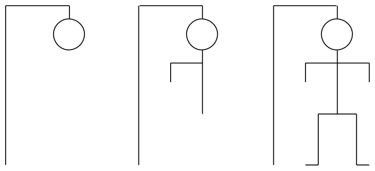
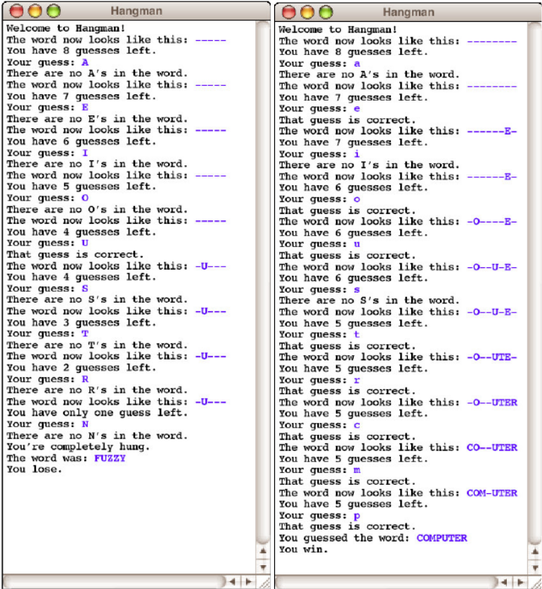
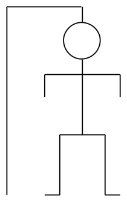
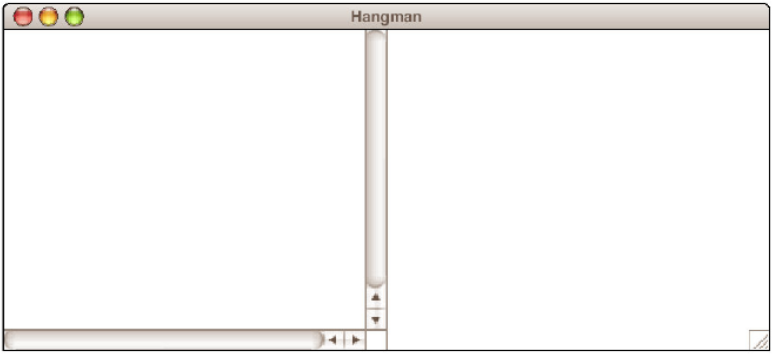
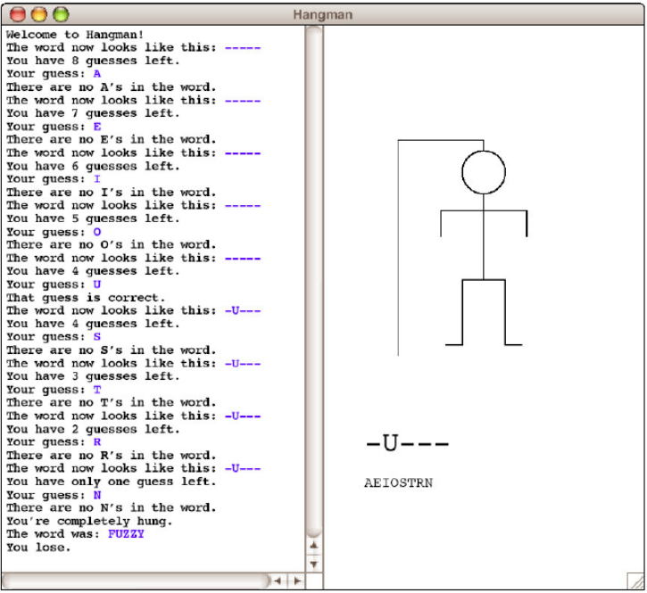

# Hangman

## Getting Started

Download and extract [the files required for this pset](cdn://pset4.zip).

## Introduction

For this assignment, your mission is to write a program that plays the game of
Hangman. As an assignment, Hangman serves two purposes. First, the program is
designed to give you some practice writing programs that manipulate strings and
files. Second, by extending the program using you will have a chance to work
with multiple classes in a single application.

When it plays Hangman, the computer first selects a secret word at random from a
list built into the program. The program then prints out a row of dashes—one for
each letter in the secret word and asks the user to guess a letter. If the user
guesses a letter that is in the word, the word is redisplayed with all instances
of that letter shown in the correct positions, along with any letters correctly
guessed on previous turns. If the letter does not appear in the word, the user
is charged with an incorrect guess. The user keeps guessing letters until either
(1) the user has correctly guessed all the letters in the word or (2) the user
has made eight incorrect guesses. Two sample runs that illustrate the play of
the game are shown in Figure 2.

When it is played by children, the real fascination (a somewhat morbid
fascination, I suppose) from Hangman comes from the fact that incorrect guesses
are recorded by drawing an evolving picture of the user being hanged at a
scaffold. For each incorrect guess, a new part of a stick-figure body — first
the head, then the body, then each arm, each leg, and finally each foot — is
added to the scaffold until the hanging is complete. For example, the three
diagrams below show the drawing after the first incorrect guess (just the head),
the third (the head, body, and left arm), and the diagram at the tragic end of a
losing game:

#### Figure 1: A hangman figure in three stages of completeness.

In order to write the program that plays Hangman, you should design and test
your program in three parts. The first part consists of getting the interactive
part of the game working without any graphics at all and with a fixed set of
secret words. The second part consists of building a separate class that
maintains the scaffold diagram. The final part requires you to replace the
supplied version of the secret word list with one that reads words from a
file. The rest of this handout describes these three parts in more detail.

#### Figure 2: Two sample runs of the Hangman program (console only).

## Part I -- Playing a console-based game

In the first part of this assignment, your job is to write a program that
handles the user interaction component of the game -- everything except the
graphical display. To solve the problem, your program must be able to:

* Choose a random word to use the secret word. That word is chosen from a word
  list, as described in the following paragraph.
* Keep track of the user’s partially guessed word, which begins as a series of
  dashes and then updated as correct letters are guessed.
* Implement the basic control structure and manage the details (ask the user to
  guess a letter, keep track of the number of guesses remaining, print out the
  various messages, detect the end of the game, and so forth).

The only operation that is beyond your current knowledge is that of representing
the list of words from which you can choose a word at random. For the first two
parts of the assignment, you will simply make use of a class that we’ve given
you called `HangmanLexicon` that provides a small list of words that will allow
you to test your program. [^1] The implementation of the class you’ve been given
is only a temporary expedient to make it possible to code the rest of the
assignment. In Part III, you will replace the definition we’ve provided with one
that reads a list of words from a data file.

[^1]: A *lexicon* is very much like a dictionary, but does not necessarily include definitions, which makes it a more appropriate name for a class that provides a list of words with no associated meanings.

The strategy of creating a temporary implementation that provides enough
functionality to implement the rest of the program is a common technique in
programming. Such temporary implementations are usually called **stubs**. In
this assignment, the starter project comes with a stub implementation of the
`HangmanLexicon` class, which appears below. The class contains two public
methods: `getWordCount()`, which returns the number of words in the lexicon, and
`getWord(i)`, which returns the word at index `i`. Like all indices in Java, the
value `i` runs from 0 to one less than the number of words.

    /**
     * File: HangmanLexicon.java
     * -------------------------
     * This file contains a stub implementation of the HangmanLexicon
     * class that you will reimplement for Part III of the assignment.
     */
    import acm.util.*;
    
    public class HangmanLexicon
    {
        /** Returns the number of words in the lexicon. */
        public int getWordCount()
        {
            return 10;
        }
    
        /** Returns the word at the specified index. */
        public String getWord(int index)
        {
            switch (index) {
                case 0: return "BUOY";
                case 1: return "COMPUTER";
                case 2: return "CONNOISSEUR";
                case 3: return "DEHYDRATE";
                case 4: return "FUZZY";
                case 5: return "HUBBUB";
                case 6: return "KEYHOLE";
                case 7: return "QUAGMIRE";
                case 8: return "SLITHER";
                case 9: return "ZIRCON";
                default: throw new ErrorException("getWord: Illegal index");
            }
        }
    }

A game that used this implementation of `HangmanLexicon` class would quickly
become uninteresting because there are only ten words available. Even so, it
will allow you to develop the rest of the program and then come back and improve
this part later.

Part I is a string manipulation problem. The sample runs in Figure 2 should be
sufficient to illustrate the basic operation of the game, but the following
points may help to clarify a few issues:

* At the beginning of your `run` method, you need to create a new
  `HangmanLexicon` and store it in an instance variable. If you extend the
  program to allow the user to play multiple games, the creation of the
  `HangmanLexicon` should be performed outside the loop that plays the game
  repeatedly so that this operation is performed once rather than for every
  game.
* You should accept the user's guesses in **either lower or upper case**, even
  though all letters in the secret words are written in upper case.
* If the user guesses something other than a single letter, your program should
  tell the user that the guess is illegal and accept a new guess.
* If the user guesses a correct letter more than once, your program should
  simply do nothing. Guessing an incorrect letter a second time should be
  counted as another wrong guess. [^2]
  
Remember to finish Part I before moving on to Part II. Part II is arguably more
fun, but it is essential to develop large programs in manageable stages.

[^2]: In each case these interpretations are the easiest way to handle the situation, and your program will probably do the right thing even if you don't thing about these in detail.

## Part II -- Adding graphics

For Part II, your task is simply to extend the program you have already written
so that it now keeps track of the Hangman graphical display. Although you might
want to spice things up in your extensions, the simple version of the final
picture for the unfortunate user who has run out of guesses looks like this:

#### Figure 3: Final hangman picture.

The scaffold and the tiny bit of rope above the head are drawn before the game
begins, and then the parts are added in the following order: head, body, left
arm, right arm, left leg, right leg, left foot, right foot. Because this picture
is simpler than most of the figures you have drawn for section problems, the
challenge of this part of the assignment does not lie so much in using the
`acm.graphics` package but rather in implementing the separation of functions
between the class that performs the console-based interaction and the class that
manages the display. That class is called `HangmanCanvas` and is included in the
starter project in the form of the stub implementation shown below.

    /*
     * File: HangmanCanvas.java
     * ------------------------
     * This file keeps track of the Hangman display.
     */
    import acm.graphics.*;
    
    public class HangmanCanvas extends GCanvas
    {
        /* Constants for the simple version of the picture (in pixels) */
        private static final int SCAFFOLD_HEIGHT = 360;
        private static final int BEAM_LENGTH = 144;
        private static final int ROPE_LENGTH = 18;
        private static final int HEAD_RADIUS = 36;
        private static final int BODY_LENGTH = 144;
        private static final int ARM_OFFSET_FROM_HEAD = 28;
        private static final int UPPER_ARM_LENGTH = 72;
        private static final int LOWER_ARM_LENGTH = 44;
        private static final int HIP_WIDTH = 36;
        private static final int LEG_LENGTH = 108;
        private static final int FOOT_LENGTH = 28;
    
        /** Resets the display so that only the scaffold appears */
        public void reset()
        {
            /* You fill this in */
        }
    
        /**
         * Updates the word on the screen to correspond to the current
         * state of the game. The argument string shows what letters have
         * been guessed so far; unguessed letters are indicated by hyphens.
         */
        public void displayWord(String word)
        {
            /* You fill this in */
        }
        
        /**
         * Updates the display to correspond to an incorrect guess by the
         * user. Calling this method causes the next body part to appear
         * on the scaffold and adds the letter to the list of incorrect
         * guesses that appears at the bottom of the window.
         */
        public void noteIncorrectGuess(char letter)
        {
            /* You fill this in */
        }
    }

This stub is somewhat different from the one shown earlier for
`HangmanLexicon`. That stub actually did something, even if it was only a part
of what the complete implementation of the class will actually do. This stub
declares several named constants that define the parameters of the picture, but
doesn't actually use them yet. The three methods in the stub implementation of
`HangmanCanvas` -- `reset`, `displayWord`, and `noteIncorrectGuess` do
absolutely nothing. This strategy, however, is also common in programming. The
fact that the class exists and exports methods means that you can call those
methods from the console-based `Hangman` class even before you complete their
implementation.

The first thing you should do when you begin Part II is to create a new
`HangmanCanvas` -- in precisely the do-nothing form in which it has been given
to you -- and install it in the program window next to the console. The
`Hangman` class itself is an instance of a `ConsoleProgram`, which means that
the startup code in the ACM libraries has installed an `IOConsole` in the window
that fills the entire space. Your next task is to add a `HangmanCanvas` to the
program window as well. You will learn much more about how to do this kind of
operation toward the end of this course, but code you need for this part is
extremely simple. First, in the instance variables section of the `Hangman`
program you need to declare an instance variable for the canvas by writing

    private HangmanCanvas canvas;

and then add the following `init` method to your program:

    public void init() {
        canvas = new HangmanCanvas();
        add(canvas);
    }

Not that your `Hangman` program will have both an `init` and a `run` method as a
result, and that is perfectly fine. This `init` method initializes the canvas
and adds it to the window prior to the `run` method being executed; the `run`
method is where the execution of your game will start after the window is
initialized. By default the contents of the program window are given equal
amounts of space side by side. Since this console program, the console is
already installed and will therefore show up in the left column. When you add
the `HangmanCanvas` it will occupy the second column, which means that the
console and graphics components of the window will each get half the screen area
as shown in Figure 4 below. Input and output from the `Hangman` program will
continue to appear on the console, and any objects you add to the
`HangmanCanvas` stored in the variable `canvas` will appear in the area on the
right.

#### Figure 4: Screenshot showing side-by-side console (left) and canvas (right).

You can now go through and add the calls to the methods in
`HangmanCanvas`. Every time you start a game, for example, you will need to call

    canvas.reset();
    
to delete all the body parts form the canvas and redraw the scaffold. Similarly,
you will have to call `displayWord` and `noteIncorrectGuess` at the appropriate
points in your code. As of yet, nothing will actually be displayed on the canvas
when you make these calls, but your program should run just the same as it did
before, freeing you to concentrate on implementing the methods in
`HangmanCanvas`. Note that you should not add any more `public` methods to
`HangmanCanvas` (adding `private` helper methods is fine though).

The implementation of `HangmanCanvas` should be reasonably
straightforward. Although the sizes of the scaffold and the various body parts
are given to you, their positions are not specified, so you will have to do some
arithmetic to calculate the coordinates. The center line of the body should be
centered horizontally on the screen, and the scaffold should be displayed a bit
higher than the center so that there is room underneath for two labels: a label
in a large font showing the secret word as it currently stands and a label in a
smaller font showing the incorrect guesses. Figure 5 shows how the screen
appears at the end of the tragic session in which the user was unable to guess
`FUZZY`.

#### Figure 5: The tragic ending of a Hangman game.

## Part III -- Reading the lexicon from a data file

Part III of this assignment is by far the easiest and requires considerably less
than half a page of code. The only problem is that you won’t have seen the Java
facilities you need to do it until the lectures next week. So the idea is to
start with parts I and II and then fill in this final detail at the end.

Your job in this part of the assignment is simply to reimplement the
`HangmanLexicon` class so that instead of selecting from a meager list of ten
words, it reads a much larger word list from a file. The steps involved in this
part of the assignment are as follows:

1. Open the data file `HangmanLexicon.txt` using a `BufferedReader` that will
allow you to read it line by line.
2. Read the lines from the file into an `ArrayList`.
3. Reimplement the `getWordCount` and `getWord` methods in `HangmanLexicon` so
that they use the `ArrayList` from step 2 as a source of the words.

The first two steps should be done in a constructor for `HangmanLexicon`, which
you will need to add to the file (see below). The last step is simply a matter
of changing the implementation of the methods that are already there.

Here is how the `HangmanLexicon` constructor should be added to the
`HangmanLexicon` class:

    public class HangmanLexicon
    {
        // This is the HangmanLexicon constructor
        public HangmanLexicon()
        {
            // your initialization code goes here
        }
        
        // rest of HangmanLexicon class...
    }

Note that nothing in the main program should have to change in response to this
change in the implementation of `HangmanLexicon`. Insulating parts of the
program from changes in other parts is a fundamental principle of good software
design.

## Extensions

There are many ways to extend Hangman to make it more fun. Here are some ideas:

* You could spice up the display a little. Stick figures may be fine for
  elementary school, but they seem a bit tame here.
* You could animate the pictures. Instead of having the body parts and letters
  merely appear on the screen, you could have them move in from off-screen, as
  pictures often do, for example, in PowerPoint slides.
* Once you get the basic structure working, you could expand the program to play
  something like Wheel of Fortune, in which the single word is replaced by a
  common phrase and in which you have to buy vowels.
* Use your imagination!

## Submit

* You can make a zip with the required files by running the following command
  in a terminal.

        make submit

    You can submit a problem set multiple times, we always grade at the last
    submission before the deadline. Make sure to submit all files when you
    resubmit, not only the files that changed.

* Go to the submit tab and send your ZIP-file to us. After the weekend, you'll
  see if you got a grade or if your submission was rejected.

* In all cases, ask your assistant for feedback on the problem set during the lab sessions. This is how you learn!

