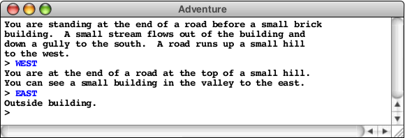
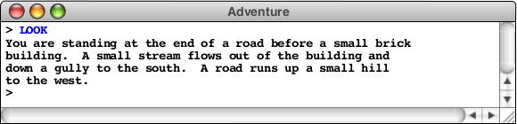
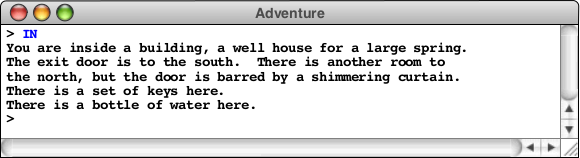
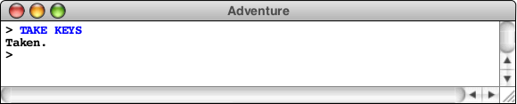
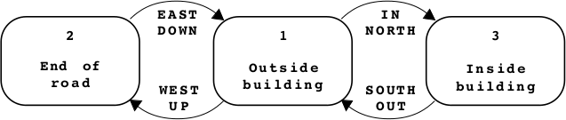
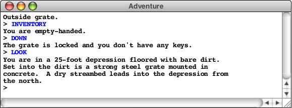

# Adventure

Welcome to the final assignment in this course! Your mission in this assignment
is to write a simple text-based adventure game in the tradition of Will
Crowther's pioneering "Adventure" program of the early 1970's. In games of this
sort, the player wanders around from one location to another, picking up
objects, and solving simple puzzles. The program you will create for this
assignment is considerably less elaborate than Crowther's original game and it
therefore limited in terms of the type of puzzles one can construct for it. Even
so, you can still write a program that captures much of the spirit and flavor of
the original game.

Because this assignment is large and detailed, it takes quite a bit of writing
to describe it all. This document contains everything you need to complete the
assignment, along with a considerable number of hints and strategic
suggestions. To make it easier to read, the document is divided into the
following sections:

1. [Expectations](#Expectations)
2. [Overview of the adventure game](#Overview)
3. [The <tt>Adventure</tt> class](#Adventure_class)
4. [The <tt>AdvRoom</tt> and <tt>AdvMotionTableEntry</tt> classes](#AdvRoom_AdvMotionTableEntry_classes)
5. [The <tt>AdvObject</tt> class](#AdvObject_class)
6. [Implementing the adventure game](#Implementing)
7. [Strategy and tactics](#Strategy)

Try not to be daunted by the size of this handout. The code is not as big as you
might think. If you follow the suggestions in the "Strategy and tactics"
section, things should work out well.

# <a id="Expectations">Expectations</a>

At the end of the first week you have to submit a beta version that reads the
data files and instantiates the `AdvObject`, `AdvRoom`, and
`AdvMotionTableEntry` objects. The `Adventure.java` file should contain code
that shows this works correctly; code that reads the data files, instantiates
the objects, and then prints their contents.

*You should submit this version on the submit tab before friday 17:00.* This
 means you'll have the second week to implement the commands and the remaining
 game code.

## Getting started

Download the starter kit from [here](cdn://pset5.zip) and extract it into your
prog directory. All files needed for this problem set are included.

## <a id="Overview">Overview of the Adventure Game</a>

The adventure game you will implement for this assignment - like any of the
text-based adventure games that were the dominant genre before the advent of
more sophisticated graphical adventures like the Myst/Riven/Exile series - takes
place in a virtual world in which you, as the player, move about from one
location to another. The locations, which are traditionally called "rooms" even
though they may be outside, are described to you through a written textual
description that gives you a sense of the geography. You move about in the game
by giving commands, most of which are simply an indication of the direction you
motion. For example, in the classic adventure game developed by Willie Crowther,
you might move about as follows:

In this example, you started outside the building, followed the road up the hill
by typing `WEST`, and arrived at a new room on the top of the hill. Having no
obvious places to go once you got there, you went back toward the east and ended
up outside the building again. As is typical in such games, the complete
description of a location appears only the first time you enter it; the second
time you come to the building, the program displays a much shorter identifying
tag, although you can get the complete description by typing `LOOK`, as follows:

From here, you might choose to go inside the building by typing `IN`, which
brings you to another room, as follows:

In addition to the new room description, the inside of the building reveals that
the adventure game also contains objects: there is a set of keys here. You can
pick up the keys by using the `TAKE` command, which requires that you specify
what object you're taking, like this:

The keys will, as it turns out, enable you to get through a grating at the
bottom of the stream bed that opens the door to Colossal Cave and the magic it
contains.

### Overview of the data files

The adventure program you will create for this assignment is entirely *data
driven*. The program itself doesn't know the details of the game geography, the
objects that are distributed among the various rooms, or even the words used to
move from place to place. All such information is supplied in the form of data
files, which the program uses to control its own operation. If you run the
program with different data files, the same program will guide its players
through different adventure games.

To indicate which data files you would like to use, the adventure program begins
by asking you for the name of the adventure. To get the adventure game
illustrated above, you would begin by typing `Crowther`, which selects the
collection of files associated with a relatively sizeable subset of Will
Crowther's original adventure game. For each adventure, there are three
associated data files that contain the name of the adventure as a prefix. For
the `Crowther` adventure, for example, these files are

* `CrowtherRooms.txt` which defines the rooms and the connections between
  them. In these examples, you have visited these rooms: outside of the
  building, the top of the hill, and the inside of the well house.
* `CrowtherObjects.txt` which specifies the descriptions and initial locations
  of the objects in the game, such as the set of keys.
* `CrowtherSynonyms.txt` which definies several words as synonyms of other words
  so you can use the game more easily. For example the compass points `N`, `E`,
  `S`, and `W` are defined to equivalent to `NORTH`, `EAST`, `SOUTH`, and
  `WEST`. Similarly, if it makes sense to refer to an object by more than one
  word, this file can define the two as synonyms. As you explore the Crowther
  cave, for example, you will encounter a gold nugget, and it makes sense to
  allow players to refer to that object using either of the words `GOLD` or
  `NUGGET`.

These data files are not Java programs, but are instead text files that describe
the structure of a particular adventure game in a form that is easy for game
designers to write. The adventure program reads these files into an internal
data structure, which it then uses to guide the player through the game.

Your program must be able to work with any set of data files that adhere to the
rules outlined in this handout. In addition to the three files with the
`Crowther` prefix the starter folder also contains a file named `TinyRooms.txt`
that contains only three rooms with no objects and no synonyms and a set of
three files with the prefix `Small` that define a much smaller part of the
`Crowther` cave. Your program should work correctly with any of those files, as
well as other adventure games that you design yourself.

The detailed structure of each data file is described later in the document in
conjunction with the desrciption of the module that processes that particular
type of data. For example, the rooms data file is described in conjunction with
the `AdvRoom` class.

### Overview of the class structure

The adventure game is divided into the following principal classes:

* `Adventure` - This is the main program class and is by far the largest module
  in the assignment. This class is yours to write, but - as will be true for all
  the classes you implement in this assignment - the public methods are
  specified by the starter files.
* `AdvRoom` - This class represents a single room in the cave. This class is
  also yours to write. The private methods that decompose parts of the operation
  are yours to design, but the specification of the public methods used to
  communicate with other modules is specified. This class is closely linked with
  the `AdvMotionTableEntry` class, wihch is described in the same section. That
  class is provided as part of the starter project.
* `AdvObject` - This class represents one of the objects in the cave. As with
  the `AdvRoom` class, you have to implement this class although the public
  methods are specified.
* `AdvMotionTableEntry` - This class defines a record type that combines a
  direction of travel, the room one reaches by moving in that direction, and an
  optional object that enables the motion. The definition of this class is
  extremely simple and is provided in the starter project.

The structure of each of these classes is described in detail in one of the
sections that follow.

Even though the code for these components is substantial, your job is made
considerably easier by the following properties of the assignment:

1. Most of the methods used to communicate among the classes have already been
designed for you. The public methods in the `AdvRoom` and `AdvObject` classe are
completely specified; all you need to do is implement them.
2. The project works from the very first moment that you get it. Each of the
classes you need to design is supplied to you in the form of a `.jar` file
containing several "magic classes" that implement all of the methods you
need. The starter files are written as subclasses of those magic classes and can
therefore call the working versions of the methods. Your job is to remove the
superclasses and implement all the necessary methods yourself. Providing these
magic superclasses makes it much easier to test your code as you go because you
can rely on our implementations.

## <a id="Adventure_class">The <tt>Adventure</tt> class</a>

The main progam class is called `Adventure` and will contain most of the code
you have to write for this assignment. This is the class that opens the data
files, assembles the data structures, maintains the list of words known by the
game, interacts with the user, and implements the various commands. For the most
part, you will have the oppertunity to figure out how to decompose the entire
operation into reasonably-sized pieces and for choosing what data structures and
methods to use in the underlying implementation.

The starter file for the `Adventure` class, `Adventure.java`, contains only one
public method, which is the `run` method invoked when the program is
started. The `run` method has the following responsibilities:

1. Ask the user for the name of an adventure, which indicates what data files to use.
2. Read in the data files for the game into an internal data structure.
3. Play the game by reading and executing commands entered by the user.

Understanding how to implement these aspects of the game, however, requires you
to learn more about the `AdvRoom` and `AdvObject` classes, which are described
in the next two sections. Section 5 then returns to the question of how to
implement the `Adventure` class, which represents the lion's share of the
assignment.

## <a id="AdvRoom_AdvMotionTableEntry_classes">The <tt>AdvRoom</tt> and <tt>AdvMotionTableEntry</tt> classes</a>

The `AdvRoom` class represents an individual room in the cave. Each room in the
cave is characterized by the following properties:

* A room number, which must be greater than zero.
* Its name, which is a one-line string identifying the room.
* Its description, which is a multiline array describing the room.
* A list of objects contained in the room.
* A flag indicating whether the room has been visited.
* A motion table specifying the exits and where they lead.

The `AdvRoom` stores this information in its private data structure and then
makes that information available to clients through the public methods exported
by the class. These methods are listed in the starter file.

### The rooms data file

The information for the individual rooms is not part of the program but is
instead stored in a data file. One of your responsibilities in completing the
implementation of the `AdvRoom` class is to write the static method
`readRoom(rd)`, which creates a new `AdvRoom` object by reading that description
from the rooms file for that adventure. At first glance, the data files for
rooms look almost exactly like those for the teaching machine. For example,
`TinyRooms.txt` looks like this:

<pre>1
Outside building
You are standing at the end of a road before a small brick
building. A small stream flows out of the building and
down a gully to the south. A road runs up a small hill
to the west.
-----
WEST    2
UP      2
NORTH   3
IN      3

2
End of road
You are at the end of a road at the top of a small hill.
You can see a small building in the valley to the east.
-----
EAST    1
DOWN    1

3
Inside building
You are inside a building, a well house for a large spring.
-----
SOUTH   1
OUT     1
</pre>

In thinking about an adventure game - particularly as the player, but also as
the implementer - it is important to recognize that the directions are not as
well behaved as you might like. There is no guarantee that if you move from one
room to another by moving north, you will be able to get back by going
south. The best way to visualize the geographic structure of an adventure game
is as a collection of rooms with labeled arrows that move from one room to
another, as illustrated by the following diagram of the connections defined in
`TinyRooms.txt`:

The connections in this graph are modeled using the `AdvMotionTableEntry` class,
which is described in a subsequent section.

### Extensions to the connection structure

If the adventure program allowed nothing more than rooms and descriptions, the
games would be extremely boring because it would be impossible to specify any
interesting puzzles. For this assignment, you are required to make the following
extensions to the data structure that provide a basis for designing simple
puzzles that nonetheless add significant interest to the game.

* *Locked passages.* The connection data structure must allow the game designer
   to indicate that a particular connection is available only if the player is
   carrying a particular object. That object then becomes the key to an
   otherwise locked passage. In the file format, such locked passages are
   specified by adding a slash and the name of an object after a room number.
* *Forced motion.* If the player ever enters a room in which one of the
   connections is associated with the motion verb `FORCED`, the program should
   display the long description of that room and then immediately move the
   player to the specified destination without waiting for the user to enter a
   command. This feature makes it possible to display a message to the player
   and is in fact identical to the design that Willie Crowther adopted in his
   original adventure game.

Both of these features are illustrated by the segment of the `SmallRooms.txt`
data file shown below. If the player is in room 6, and tries to go down, the
following two lines in the connection list come into play:

<pre>
DOWN     8/KEYS
DOWN     7
</pre>

Excerpt from `SmallRooms.txt`
<pre>6
Outside grate
You are in a 25-foot depression floored with bare dirt.
Set into the dirt is a strong steel grate mounted in
concrete. A dry streambed leads into the depression from
the north.
-----
NORTH   5
UP      5
DOWN    8/KEYS
DOWN    7

7
Above locked grate
The grate is locked and you don't have any keys.
-----
FORCED  6

8
Beneath grate
You are in a small chamber beneath a 3x3 steel grate to
the surface. A low crawl over cobbles leads inward to
the west.
-----
UP      6
OUT     6
IN      9
WEST    9</pre>

The first line is active only if the player is carrying keys. In this case, the
player moves into room 8 which is the beginning of the underground portion of
the cave. If not, the `DOWN` command takes the user to room 7. Because the
motion entries include the verb `FORCED`, the program prints out the long
description for room 7 and then moves the player back to room 6, as shown in the
following sample run:

It is possible for a single room to use both the locked passage and forced
motion options. The `CrowtherRooms.txt`, for example, contains the following
entry for the room just north of the curtain in the building:

<pre>70
Curtain1
-----
FORCED  71/NUGGET
FORCED  76</pre>

The effect of this set of motion rules is to force the user to room 71 if that
user is carrying the nugget and to room 76 otherwise.

When you are testing your code for locked and forced passages you might want to
pay particular attention to the rooms in the `CrowtherRooms.txt` that implement
the shimmering curtain that marks the end of the game.

### The <tt>AdvMotionTableEntry</tt> class

There are several possible strategies one might have chosen to represent the
table of connections in each room to its neighbors. In this assignment, you
should store the room connections as a list of objects each of which is an
instance of the class `AdvMotionTableEntry`. The complete definition of this
class is included with the starter file. You could easily have designed this
class yourself, but its implementation is so simple that doing so would not have
helped you learn anything important. Because the class appears as the result
type of a public method it seemed easier simply to provide it to you directly.

## <a id="AdvObject_class">The <tt>AdvObject</tt> class</a>

The `AdvObject` class keeps track of the information about an object in the
game. The amount of information you need to maintain for a given object is
considerably less than you need for rooms, which makes both the internal
structure and its external representation as a data file much simpler. The
entries in the object file consist of three lines indicating the word used to
refer to the object, the description of the object that appears when you
encounter it, and the room number in which the object is initially located. For
example, the data file `SmallObjects.txt` looks like this:

<pre>KEYS
a set of keys
3

LAMP
a brightly shining brass lamp
8

ROD
a black rod with a rusty star
12</pre>

This file indicates that the keys start out in room 3 (inside the building), the
lamp initially resides in room 8 (beneath the grating), and the rod can be found
in room 12 (the debris room). The entries in the file may be separated with
blank lines for readability, as these are here; your implementation should work
equally well if these blank lines are omitted.

The objects, of course, will move around in the game as the player picks them up
or drops them. Your implementation must therefore provide a facility for storing
objects in a room or in the user's inventory of objects. The easiest approach is
to use an `ArrayList`, which makes it easy to add and remove objects.

The file for the `AdvObject` class is included in the starter kit. The
implementation of these methods should be quite straightforward, particularly in
the comparison to those in the `AdvRoom` class, which significantly more
complicated.

## <a id="Implementing">Implementing the Adventure game</a>

As noted in the introduction of the assignment, implementing the `Adventure`
class represents the lion's share of the work. Before you start in on the code,
it will simplify your life considerably if you spend some time thinking about
the data structures you need and what the overall decomposition looks like.

The `run` method for the `Adventure` class must execute each of the following
steps:

1. Ask the user for the name of the adventure, which indicates what data files to use.
2. Read in the data files for the game into an internal data structure.
3. Play the game by reading and executing commands entered by the user.

Asking the user for the name of the adventure is nothing more than a call to
`readLine`. The other two phases are substantial enough to warrant subsections
of their own.

### Reading in the data files

Once you have the name of the adventure, the next phase in the program is to
read in the data files that contain all the information necessary to play the
game. As noted in the section entitled "Overview of the data files", every
adventure name. For example, if the adventure name is `Crowther`, these files
are named `CrowtherRooms.txt`, `CrowtherObjects.txt`, and
`CrowtherSynonyms.txt`. The formats of the first two files have already been
described in the discussion of the `AdvRoom` and `AdvObject` classes. Each of
those classes, moreover, includes a static method that reads the data for one
room or one object from a `BufferedReader`. All the `Adventure` class has to do,
therefore, is

1. Open the appropriate file to obtain the `BufferedReader` object.
2. Create an empty data structure for the rooms and objects, as appropriate.
3. Call `AdvRoom.readRoom` or `AdvObject.readObject` to read in a new value.
4. Add the new room or object to your data structure.
5. Repeat steps 3 and 4 until `readRoom` or `readObject` returns `null`.
6. Close the reader.

The rooms file must be present in every adventure, and your program should print
an appropriate error message if that file is missing. If the objects file is
missing - as it is for the `Tiny` adventure - your program should simply assume
that there are no objects.

The only file whose format you haven't seen is the synonyms file, which is used
to define abbreviations for commands and synonyms for the existing objects. The
synonym file consists of a list of lines in which one word is defined to be
equal to another. The `CrowtherSynonyms.txt` file, for example, appears
below. This file shows that you can abbreviate the `INVENTORY` command to `I` or
the `NORTH` command to `N`. Similarly, the user can type `GOLD` to refer to the
object defined in the object file as `NUGGET`. As with the objects file, the
synonyms file is optional. If it doesn't exists, your program should simply
assume that there are no synonyms.

The `CrowtherSynonyms.txt` file
<pre>Q=QUIT
L=LOOK
CATCH=TAKE
RELEASE=DROP
I=INVENTORY
N=NORTH
S=SOUTH
E=EAST
W=WEST
U=UP
D=DOWN
BACK=OUT
GOLD=NUGGET
BAG=COINS
NEST=EGGS
WATER=BOTTLE</pre>

The hard part of reading the data files is not the operational aspects of
reading lines from a data file and dividing the line up into pieces, but rather
designing the data structure into which you store the data. Each line of the
synonyms file consists of two strings separated by an equal sign. You can
separate the string into its component pieces in any of the number of ways, but
you can also have to figure out how you want to store the information so that it
is useful to your program.

### Executing commands

Once you have read in the data, you need to play the game. The user will always
start in room 1 and then move around from room to room by entering commands on
the console. The process of reading a command consists of the following steps:

1. Read the line from the user.
2. Break the line up into a verb representing the action and an object (if
specified) indicating the target of that action. In the game you have to write,
the object is relevant only for the `TAKE` and `DROP` command, but your
extensions might add other verbs that take objects as well. In this phase, you
should make sure to convert the words to uppercase and check the synonyms table
to ensure that you're working with the canonical form of each word. For example,
if the user enters the line <tt>release gold</tt> your program should decide
that the verb is `DROP` and the object is `NUGGET`.
3. Decide what kind of operation the verb represents. If the word appears in the
motion table for some room, then it is a motion verb. In that case, you need to
look it up in the motion table for the current room and see if it leads anywhere
from the current room. If it isn't a motion verb, the only legal possibilities
(outside of any extenions you write) is that it is one of the six built-in
action verbs described in the next section: `QUIT`, `HELP`, `LOOK`, `INVENTORY`,
`TAKE`, and `DROP`. If you have an action verb, you have to call a method that
implements the appropriate action, as outlined in the following section. In any
other case, you need to tell the user that you don't understand the word.

In the previous versions of this assignment, I've insisted that students
implement the action verbs by defining commands in an Java class
hierarchy. While that strategy is certainly more extensible, it is clearly
overkill for an assignment with just six commands. It's much easier to use a
cascading `if` statement that first checks if the verb is "`QUIT`", then checks
to see if it's "`HELP`", and so on.

#### The built-in commands

* `QUIT` This command signals the end of the game. Your program should stop
  reading commands and exit from the `run` method.
* `HELP` This command should print instructions for the game on the console. You
  need not duplicate the instructions from the stub implementation exactly, but
  you should certainly give users an idea of how your game is played. If you
  make any extensions, you should describe them in the output of your `HELP`
  command so that we can easily see what exciting things we should look for.
* `INVENTORY` This command should list what objects the user is holding. If the
  user is holding no objects, your program should say so with a message along
  the lines of "You are empty-handed."
* `LOOK` This command should type the complete description of the room and its
  contents, even if the user has already visited the room.
* `TAKE` *obj* This command requires a direct object and has the effect of
  taking the object out of the room and adding it to the set of objects the user
  is carrying. You need to check to make sure that the object is actually in the
  room before you let the user take it.
* `DROP` *obj* This command requires a direct object and has the effect of
  removing the object from the set of objects the user is carrying and adding it
  back to the list of objects in the room. You need to check to make sure that
  the user is carrying the object.

# <a id="Strategy">Strategy and Tactics</a>

Even though the adventure program is big, the good news is that you do not have
to start from scratch. You instead get to start with a complete program that
solves the entire assignment because each of the classes you need to write is
implemented as a subclass of a library stub that performs all of the necessary
functions. Your job is simply to replace all of the stubs with code of your
own. In your final version, the implementation of `Adventure` should be a direct
subclass of `ConsoleProgram` and the `AdvRoom` and `AdvObject` classes should
not specify a superclass at all.

The following suggestions should enable you to complete the program with
relatively little trouble:

* Get each class working before you start writing the next one.* Because the
   starter project supplies magic superclasses that implement each of the
   classes you need to write, you don't have to get everything working before
   you can make useful progress. Work on the classes one at the time, and debug
   each one thoroughly before moving on to the next. My suggestion is to start
   with `AdvObject` and `AdvRoom`, and then move on to the more difficult
   implementation of `Adventure` itself.

* Use the smaller data files for most of your testing.* Don't try to test your
   code on the `Crowther` data files. These files take time to read in and are
   complicated only because of their scale. The `Tiny` data files are
   appropriate for the basic functionality, and the `Small` data files have
   examples of every required feature. When you finish you implementation, it
   makes sense to try the larger data files just to make sure everything
   continues to work in the larger context.

* Test your program thoroughly against this document and the magic
   superclasses.* When you think you've finished, go back through this document
   and make sure that your program meets the requirements stated in the
   assignment. Look for special cases in the assignment description and make
   sure that your program handles them correctly. If you're unsure about how
   some case should be handled, play with the version containing the stub code
   and make sure that your program operates in the same way.

## Submit

* You can make a zip with the required files by running the following command
  in a terminal.

        make submit

    You can submit a problem set multiple times, we always grade at the last
    submission before the deadline. Make sure to submit all files when you
    resubmit, not only the files that changed.

* Go to the submit tab and send your ZIP-file to us. After the weekend, you'll
  see if you got a grade or if your submission was rejected.

* In all cases, ask your assistant for feedback on the problem set during the lab sessions. This is how you learn!
