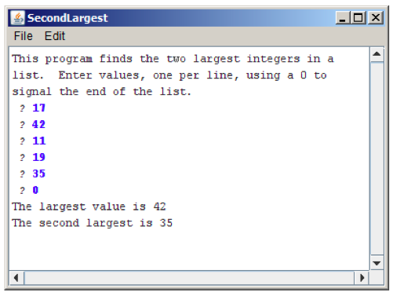
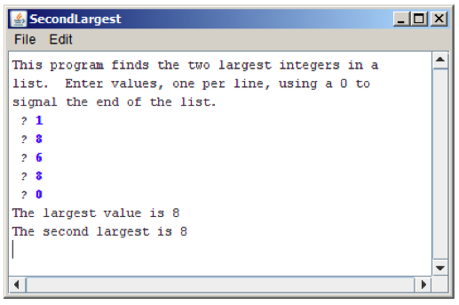

# Practice Quiz

During the quiz, you are allowed to use one (1) sheet of A4 paper containing
written or typed notes on any subject, and a pen, nothing else.

You are to write your solutions on paper, in pseudocode or in real Java(TM),
and you do not need to remember or specify which libraries to `import` to use
special functions. You can use any library that is used in problem sets 1--3.
Any external methods you use must actually exist, of course!

## Problem 1: An error

The following program will most certainly cause a runtime error. What kind of
error will be reported if you run it anyway?

	public static void countdown(int n) {
		System.out.println(n);
		countdown(n-1);
	}

* `ArrayIndexOutOfBoundsException`
* `ArithmeticException`
* `NoClassDefFoundError`
* `StackOverflowError`

How could you fix this error?

## Problem 2: Simple Java expressions, statements, and methods

1. Compute the value of each of the following Java expressions. If an error
occurs during any of these evaluations, write **Error** on that line and
explain briefly why the error occurs.

    |expression               |output |type   |
    |-------------------------|-------|-------|
    |`5.0 / 4 - 4 / 5`        |<input>|<input>|
    |`7 < 9 - 5 && 3 % 0 == 3`|<input>|<input>|
    |`"B" + 8 + 4`            |<input>|<input>|

2. What output is printed by the following program?

		/*
		 * This program doesn't do anything **useful** and exists only to test
		 * your understanding of method calls and parameter passing.
		 */

		import acm.program.*;
		
		public class Problem2b extends ConsoleProgram {

			public void run() {
				int num1 = 2;
				int num2 = 13;
				println("The 1st number is: " + Mystery(num1, 6));
				println("The 2nd number is: " + Mystery(num2 % 5, 1 + num1 * 2));
			}

			private int Mystery(int num1, int num2) {
				num1 = Unknown(num1, num2);
				num2 = Unknown(num2, num1);
				return(num2);
			}

			private int Unknown(int num1, int num2) {
				int num3 = num1 + num2;
				num2 += num3 * 2;
				return(num2);
			}
		}

	<textarea></textarea>

## Problem 3: Simple Java programs

In problem set 2, you wrote a program to find the largest and smallest integers
in a list entered by the user. For this problem, write a similar program that
instead finds the largest and the second-largest integer. As in the homework
problem, you should use 0 as a sentinel to indicate the end of the input list.
Thus, a sample run of the program might look like this:

To reduce the number of special cases, you may make the following assumptions:

* The user must enter at least two values before the sentinel.

* All input values are positive integers.

* If the largest value appears more than once, that value should be listed as
  both the largest and second-largest value, as shown in the following sample
  run:

## Problem 4: Loopy

Note; this program is the solution to problem 1. On the exam, these would be
different programs, of course.

Convert the method below into a `while` and a `for` loop, respectively.

	public static void countdown(int n) {
		if (n == 0) {
			System.out.println("Blastoff!");
		} else {
			System.out.println(n);
			countdown(n-1);
		}
	}

Using a `while` loop:

<textarea></textarea>

Using a `for` loop:

<textarea></textarea>

## Problem 5: Stump the Chump

We slightly disfigured the following program. Your job is to find out what's
wrong with it and correct it. Also, write down what the output of the program
is when run after correcting it.

	String fruit = "banana";
	int index = 0;
	while (index < fruit.length) {
		char letter = fruit.charAt(index);
		System.out.println(letter);
		index = index + 1;
	}
