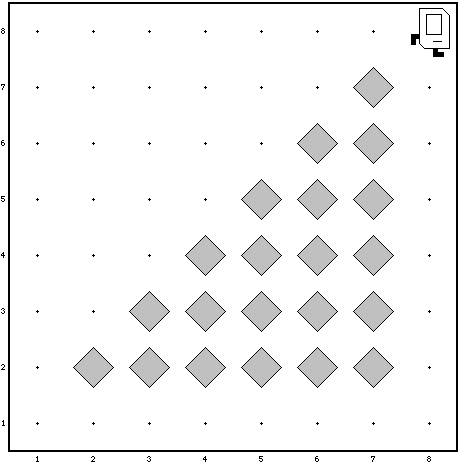

## Quiz 1 ##

During the quiz, you are allowed to use one (1) sheet of A4 paper containing
written or typed notes on any subject, and a pen, nothing else.

All questions are in English, but you are allowed to write your answers in
English, Dutch and Python.

You are to write your solutions on paper, in pseudocode or in real Java(TM),
and you do not need to remember or specify which libraries to `import` to use
special functions. You can use any library that is specified in problem sets
1--3. Any external methods you use must actually exist, of course!

## Problem 1: Warming up (10 minutes --- no credits)

The following program will most certainly cause a runtime error.

	import acm.program.*;
	
	public class SumArray extends ConsoleProgram
	{
	    public static void run()
	    {
	        // just an example array containing five elements
	        int[] arr = { 1, 2, 3, 4, 5 };
	        int   sum = sumArray(arr);
	    }
    
	    // sums any array containing ints
		public static int sumArray(int arr[])
	    {
	        // calc the whole array, so start from position 0 in the array
	        return sumArrayFrom(arr, 0);
	    }
    
	    // sums any array containing ints, counting from the position n
		public static int sumArrayFrom(int arr[], int n)
	    {
			if(n > arr.length)
				return 0;
			else
	            // this element + sum of rest of the array
				return arr[n] + sumArrayFrom(arr, n+1);
		}
	}

1. What kind of error will be reported if you run it anyway?

	* `ArrayIndexOutOfBoundsException`
	* `ArithmeticException`
	* `NoClassDefFoundError`
	* `StackOverflowError`

2. How could you fix this error?

	.
	.

## Problem 2: Rocky Steps (20 minutes --- 20 points)

We want to write a Karel program which will create a set of majestic steps for
Rocky to walk on.

In solving this problem, you can count on the following facts about the world:

* You may assume that the world where the steps are built, is at least 3x3
  square (which would mean only one step or beeper).

* Karel starts off facing East at the corner of 1st Street and 1st Avenue with
  an infinite number beepers in its beeper bag.

* We do not care about Karel's final location or heading.

* You do not need to worry about efficiency.

* You are limited to the instructions in the Karel booklet; the only variables
  allowed are loop control variables used within the control section of the for
  loop.

On the next page, give an algorithm to solve this problem. You can use all
Karel and SuperKarel methods but no functions from other libraries.

	.
	
	
	
	
	.

## Problem 3: Expressions, statements, and methods (20 minutes --- 20 points)

1. Compute the value of each of the following Java expressions. If an error
occurs during any of these evaluations, write **Error** on that line and
explain briefly why the error occurs.

    |expression                    |&nbsp;&nbsp;&nbsp;value|
    |------------------------------|-------|
    |`"The value is " + 3.14153`   |&nbsp;&nbsp;&nbsp;&nbsp;&nbsp;&nbsp;&nbsp;|
    |`7 / +4`                      |&nbsp;|
	|`2 * 4.0 + 3 / 2`             |&nbsp;|
    |`(20 - 2 * 9) / (20 - 2 * 10)`|&nbsp;|
	|`3 == 7 / 2 || 4 % 2 == 2 && 5 / 2 > 2`|&nbsp;|
    |`(123 / 10) % 10`             |&nbsp;|

2. Given this program:

		/*
		 * This program doesn't do anything useful and exists only to test
		 * your understanding of method calls and parameter passing.
		 */
	
		import acm.program.*;
	
		public class Halloween extends ConsoleProgram
		{
			public void run()
			{
				geest(13);
			}

			private void geest(int x)
			{
				int y = 0;
				for (int i = 1; i < x; i *= 2)
				{
					y = heks(y, skelet(x, i));
				}
				println("geest: x = " + x + ", y = " + y);
			}

			private int heks(int x, int y)
			{
				x = 10 * x + y;
				println("heks: x = " + x + ", y = " + y);
				return x;
			}

			private int skelet(int x, int y)
			{
				return x / y % 2;
			}
		}

What output is printed?

	.
	
	.

## Problem 4: Simple Java programs (25 minutes --- 25 points)

In problem set 2, you wrote a program to find the largest and smallest integers
in a list entered by the user. For this problem, write a similar program that
instead computes the average of all integers entered. As in the homework
problem, you should use 0 as a sentinel to indicate the end of the input list.
Thus, a sample run of the program might look like this:

	This program computes the average of all values in a list. Enter
	values, one per line, using a 0 to signal the end of the list
	 ? 23
	 ? 44
	 ? 12
	 ? 81
	 ? 99
	 ? 0
	The average of these values is 51.8

To reduce the number of special cases, you may make the following assumptions:

* The user must enter at least one value before the sentinel.

* All input values are positive integers.

Write your program here:

	.
	
	
	
	
	
	
	
	
	
	
	
	
	
	
	
	
	
	
	
	
	
	
	
	
	
	
	
	
	
	
	
	
	
	
	.

## Problem 5: Loopy (15 minutes --- 15 bonus points)

Convert the method below into a `while` and a `for` loop, respectively.

	public static int factorial(int n)
	{
		if (n == 0)
		{
				return 1;
		}
		else
		{
			int recurse = factorial(n - 1);
			int result = n * recurse;
			return result;
		}
	}

Using a `while` loop:

	public static int factorial(int n)
	
	
	
	
	
	
	
	
	
	
	
	
	
	
	
	
	
	.

Using a `for` loop:

	public static int factorial(int n)
	
	
	
	
	
	
	
	
	
	
	
	
	
	
	
	
	
	.

## Problem 6: Stump the Chump (10 minutes --- 10 points)

We slightly disfigured the following program (it's got a small syntax error
according to `javac`). Your job is to find out what's wrong with it and correct
it.

	public String zoop(String str)
	{
		String result = "";
		for(int i = 0 ; i < str.length(); i++)
		{
			result = str.charAt[i] + result;
			return result;
		}
	}

Also, write down what the output of the program is when run after correcting it.

	public void run()
	{
		println(zoop("alphabet"))
	}
